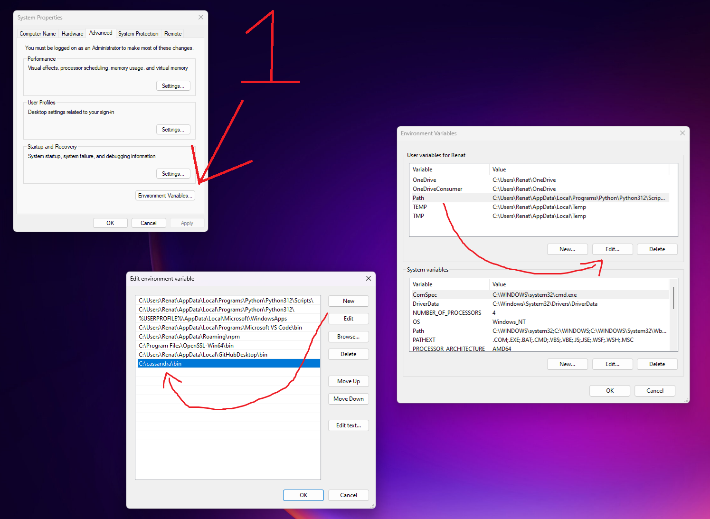

# Tecnologia escolhida

Optamos por usar o Cassandra como tecnologia para este projeto. O Cassandra é um banco de dados NoSQL distribuído, projetado para lidar com grandes volumes de dados e operações de alta velocidade. Ele é conhecido por sua escalabilidade e baixa latência, sendo amplamente utilizado em aplicações que exigem alto desempenho e tolerância a falhas.

---

# League of Legends Worlds Stats

O dataset escolhido para realizar este trabalho foi o League of Legends Worlds (2011-2022) Stats, que possui diversos dados sobre times e jogadores do Campeonato Mundial de League of Legends dos anos de 2011 até 2022.


[Link para o dataset League of Legends Worlds (2011-2022) Stats](https://www.kaggle.com/datasets/pedrocsar/league-of-legends-worlds-20112022-stats)

---

# Modelo lógico


---
# Banco de dados MYSQL

## Pré-requisitos

- [Docker](https://docs.docker.com/get-docker/) - Tenha instalado o Docker.
- [Docker Compose](https://docs.docker.com/compose/install/) - Tenha instalado o Docker Compose
- necessario ter python e instalar as bibliotecas pandas e mysql-connector-python
    ```bash
    pip install pandaspip 
    pip install mysql-connector-python
    ```

## Passos a passo

1. **Clone o repositório**

    ```bash
    git clone https://github.com/paulohenriquenc/grupopprt.git
    cd grupopprt
    ```

2. **Suba o [docker-compose](./Docker-Compose.yml)**: fora do container a porta é |3307| dentro é |3306|

    ```bash
    docker-compose up -d
    ```
    - cria o banco de dados a partir de: [lolscript.sql](/DDL/lolscript.sql)
    

3. **Para verificar o container**

    ```bash
    docker ps
    ```
4. **-Execute [script.py](./mysql_script.py)**

    o script irá inserir os dados no banco de dados

5. **Para interagir com o container**: 

    ```bash
    docker exec -it grupopprt-mysql-1 bash
    ```
    **caso não funcione substitua grupopprt-mysql-1 pelo nome do container*
   
6. **para entrar no mysql do container**

    ```bash
    mysql -uroot -proot loldb
    ```
   
6. **Para parar o container**

    ```bash
    docker-compose down
    ```

# Instação do Apache Cassandra

1. **Baixe um arquivo .zip ou .tar.gz no site oficial do [Cassandra](https://cassandra.apache.org/_/download.html)**

2. **Extraia a pasta**

    você pode extrair para um diretorio como: C:\cassandra\
    
3. **edite as variaveis de ambiente**
   
    pesquise por "variaveis de ambiente"
   

4. **Inicie o cassandra**
    vá até o diretorio instalado
   
    ```bash
    cd C:\cassandra
    ```
    


