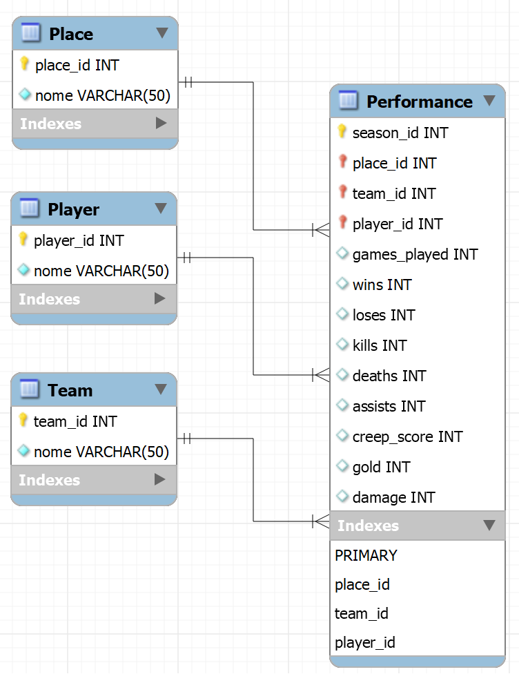
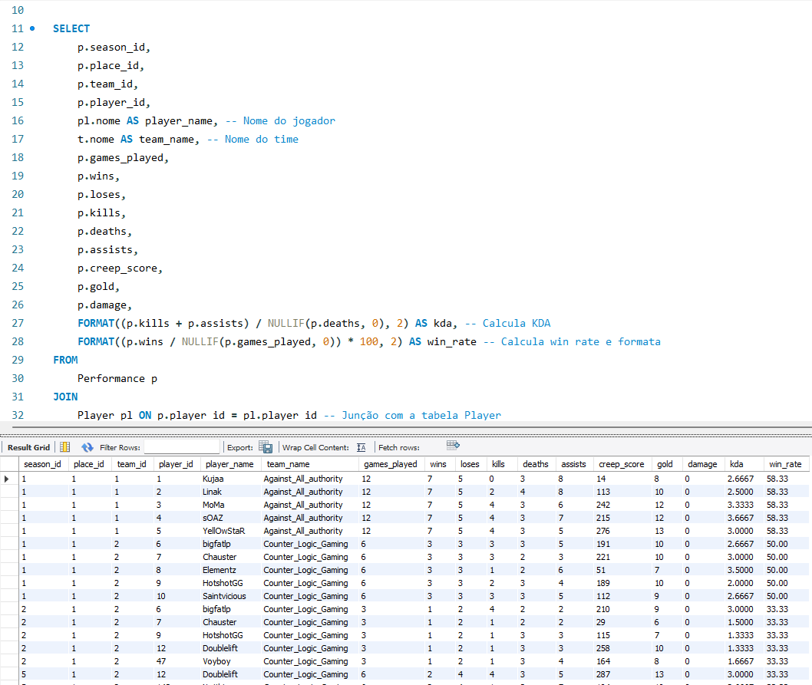
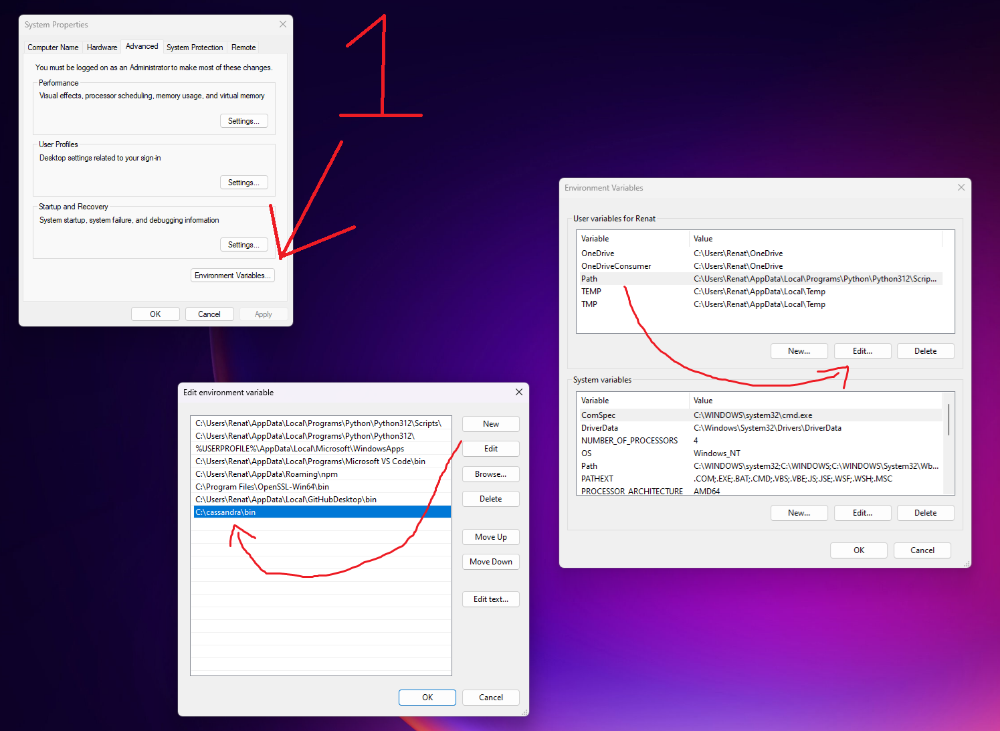

# Tecnologia escolhida

Optamos por usar o Cassandra como tecnologia para este projeto. O Cassandra é um banco de dados NoSQL distribuído, projetado para lidar com grandes volumes de dados e operações de alta velocidade. Ele é conhecido por sua escalabilidade e baixa latência, sendo amplamente utilizado em aplicações que exigem alto desempenho e tolerância a falhas.

---

# League of Legends Worlds Stats

O dataset escolhido para realizar este trabalho foi o League of Legends Worlds (2011-2022) Stats, que possui diversos dados sobre times e jogadores do Campeonato Mundial de League of Legends dos anos de 2011 até 2022.


[Dataset League of Legends Worlds (2011-2022) Stats](https://www.kaggle.com/datasets/pedrocsar/league-of-legends-worlds-20112022-stats)
[Arquivo csv](./assets/players_stats.csv)

---

# Modelo lógico



---
# Tutorial

## Pré-requisitos

- [Cassandra documentação](https://cassandra.apache.org/doc/latest/cassandra/installing/installing.html#prerequisites)
- [Docker](https://docs.docker.com/get-docker/) - Tenha instalado o Docker.
- [Docker Compose](https://docs.docker.com/compose/install/) - Tenha instalado o Docker Compose
- necessario ter [java](https://www.oracle.com/java/technologies/downloads/) SDK 11 ou 17
- necessario ter [python](https://www.python.org/downloads/) 3.8 - 3.11 e instalar as bibliotecas pandas, mysql-connector-python e cassandra-driver
    ```bash
    pip install pandas
    pip install mysql-connector-python
    pip install cassandra-driver
    ```
    ou
    ```bash
    pip install -r requirements.txt
    ```

## Passo a passo

1. **Clone o repositório**

    ```bash
    git clone https://github.com/paulohenriquenc/grupopprt.git
    cd grupopprt
    ```

2. **Suba o [docker-compose](./Docker-Compose.yml)**: fora do container a porta é |3307| dentro é |3306|

    ```bash
    docker-compose up -d
    ```
   **provavelmente(talvez não) vai cria o banco de dados mySQL a partir de: [mysql_create.sql](/DDL/mysql_create.sql)*
    

3. **Para verificar o container**

    ```bash
    docker ps
    ```
    
4. **-Execute [mysql_insert.py](./DML/mysql_insert.py)**

    o script irá inserir os dados de [players_stats.csv](./assets/players_stats.csv) no banco de dados mySQL
   
5. **-Execute [cassandra_create.py](./DQL/cassandra_create.py)**

    o script irá criar a keyspace e a tabela do banco de dados Cassandra
   
6. **-Execute [cassandra_insert.py](./DML/cassandra_insert.py)**

    o script irá copiar os dados do banco de dados mySQL e transferir para o cassandra

7. **Para interagir com o container**: 

    ```bash
    docker exec -it grupopprt-mysql-1 bash
    ```
    **caso não funcione substitua grupopprt-mysql-1 pelo nome do container*
   
8. **Para entrar no terminal mysql no container**

    ```bash
    mysql -uroot -proot loldb
    ```

9. **Para entrar no terminal cassandra no container**

    ```bash
    cqlsh
    ```

10. **Consultas estão em: [DQL](./DQL)**

    
   
11. **Para descer o container**

    ```bash
    docker-compose down
    ```

---

# Instação do Apache Cassandra na maquina (sua conta e risco)

1. **Baixe um arquivo .zip ou .tar.gz no site oficial do [Cassandra](https://cassandra.apache.org/_/download.html)**

2. **Extraia a pasta**

    você pode extrair para um diretorio como: C:\cassandra\
    
3. **edite as variaveis de ambiente**
   
    pesquise por "variaveis de ambiente"
   

4. **Inicie o cassandra**
    vá até o diretorio instalado
   
    ```bash
    cd C:\cassandra
    ```
